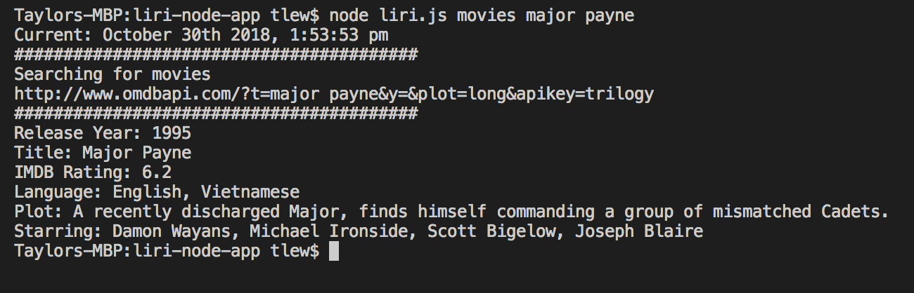
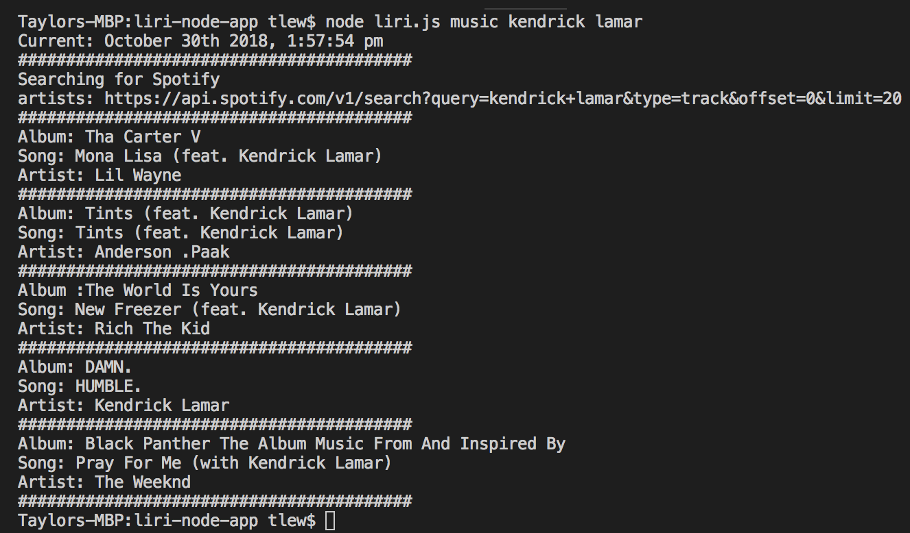
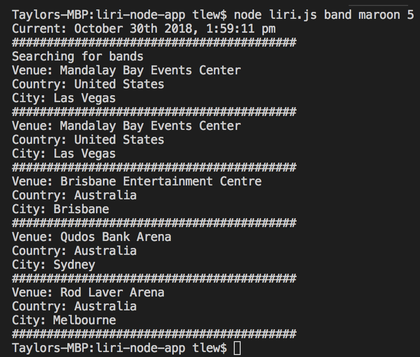

# liri-node-app

## File

* [`liri.js`]

* The liri-node-app is an application that allows the user to search for movie titles, spotify top 5 songs, and bands in town using the Node.js server. 

### Instructions

Make it so liri.js can take in one of the following commands:

Example: 'node liri.js movies major payne'

* band -  Bands in Town venues
* music - Spotify API
* movies - Retrieves OMDB API

### Technologies used

* Node.Js
* Moment.js
* OMDB API
* Bandsintown API
* Spotify API

### Screenshots

